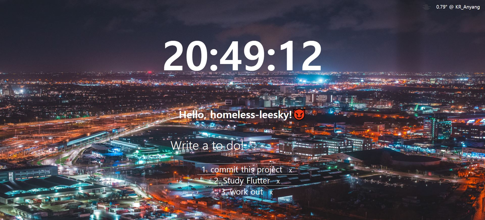

# Nomad-Coder-VanillaJS-tutorial

**This repository is Nomad Coder's VanillaJS-Tutorial repository.**

      

**Simple Project(TODO list)**

**link :** `https://homeless-leesky.github.io/Nomad-Coder-VanillaJS-tutorial/`

**Learning Objectives :**

     1. MAIN(핵심 목표)
         - VanillaJS의 문법을 익힌다.
         - Javascript 이해도 향상.
         - Open Weather API 사용방법 이해
         
     2. SUB(부수적 효과)
        - 프로젝트를 진행하면서 좋은 코딩 스타일(Nicolas는 이것을 섹시하다고 표현한다.)을 익힌다.
     

**Goal :**
    
    1. 자바스크립트 내장객체 이해하기
    2. 동기와 비동기
    3. http request, response -> api 공부
    4. 자바스크립트 Promise
    5. 함수형 프로그래밍
    6. 자바스크립트 테스트코드 환경
    7. 자바스크립트 바이블책 사서 군대 다녀오기.
    8. 주요 개념 어느정도 익힌 후 -> ES6 배우고 프로젝트 후 -> 프레임워크, 라이브러리 배우기
    
