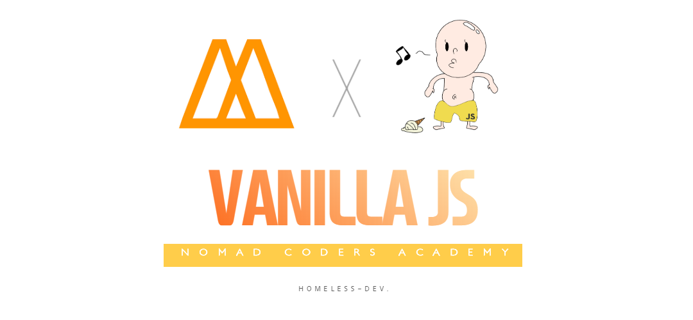

# Nomad-Coder-VanillaJS-tutorial

**This repository is Nomad Coder's VanillaJS-Tutorial repository.**

      

**Learning Objectives :**

     1. MAIN(핵심 목표)
         - VanillaJS의 문법을 익힌다.
         - Javascript 이해도 향상.
         
     2. SUB(부수적 효과)
        - 프로젝트를 진행하면서 좋은 코딩 스타일(Nicolas는 이것을 섹시하다고 표현한다.)을 익힌다.
       
